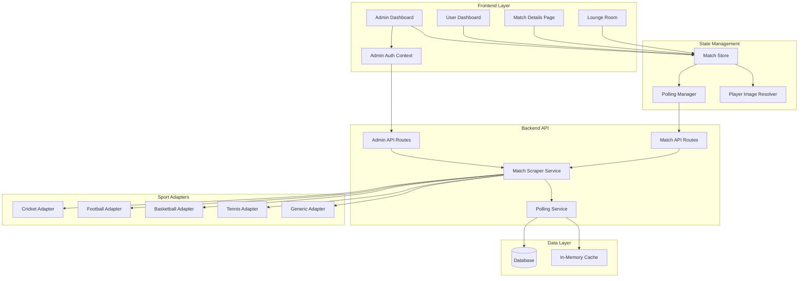

# Technical Design Document: Admin Live Match System

## Overview

This document specifies the technical design for an admin live match tracking system that enables administrators to manage upcoming and live matches, automatically detect match status transitions, display real-time scorecard data with player images, and provide comprehensive live match information across multiple sports (Cricket, Football, Basketball, Tennis).

The system extends the existing SportsX dashboard with admin-only capabilities for match management, implements a sophisticated polling architecture for real-time updates, redesigns the scorecard interface with comprehensive live data, and provides sport-specific adapters for parsing different data formats.

### Key Features

- **Admin Authentication**: Hardcoded admin credentials with role-based access control
- **Admin Dashboard**: Identical to user dashboard with floating FAB buttons for match management
- **Match Management**: Add upcoming and live matches with URL-based scraping
- **Auto Live Detection**: 60-second polling for upcoming matches with automatic promotion to live status
- **Live Polling**: 1-second updates for live matches with optimized re-rendering
- **Scorecard Redesign**: Comprehensive live scorecard with sticky header, live window, batting/bowling tables, timeline, and projected scores
- **Lounge Integration**: Real scorecard data replacing dummy data in lounge rooms
- **Player Images**: 36×36px in tables, 64×64px in live window from all players.txt
- **Multi-Sport Support**: Cricket, Football, Basketball, Tennis adapters with generic fallback
- **Error Handling**: Retry logic, connection lost banners, graceful degradation
- **Performance**: React.memo, useMemo, debouncing for smooth 1-second updates
- **Data Persistence**: Database storage with server restart recovery

## Architecture

### System Components



### Data Flow

1. **Admin adds match** → AdminAPI validates → ScraperService scrapes URL → Sport Adapter parses → DB stores → PollingService starts
2. **Polling cycle** → PollingService fetches URL → Sport Adapter parses → Cache updates → Frontend polls API → MatchStore updates → Components re-render
3. **Auto promotion** → PollingService detects live → Status changes to "Live" → Polling interval switches from 60s to 1s
4. **Match end** → PollingService detects completion → Status changes to "Completed" → Polling stops → Final result stored

## Components and Interfaces

### Frontend Components

#### 1. Admin Dashboard (`/admin/dashboard`)

**Purpose**: Identical to user dashboard with admin-only FAB buttons for match management

**Props**: None (uses auth context)

**State**:
```typescript
interface AdminDashboardState {
  isAdmin: boolean;
  showAddUpcomingModal: boolean;
  showAddLiveModal: boolean;
}
```

**Key Features**:
- Renders existing Dashboard component
- Overlays floating FAB buttons (bottom-right, stacked vertically)
- FAB 1: Add Upcoming Match (Clock icon)
- FAB 2: Add Live Match (Radio icon)
- Protected route requiring admin authentication

#### 2. Add Upcoming Match Modal

**Purpose**: Form for adding upcoming matches with auto-live detection

**Props**:
```typescript
interface AddUpcomingMatchModalProps {
  isOpen: boolean;
  onClose: () => void;
  onSuccess: (match: Match) => void;
}
```

**Form Fields**:
- URL (text, required, validated as URL)
- Sport (select: Cricket, Football, Basketball, Tennis)
- Section (select: Upcoming, Featured)
- Title (text, required, max 100 chars)
- Date (date picker, required)
- Time (time picker, required, IST timezone)

**Validation**:
- URL must be valid HTTP/HTTPS
- Date must be future date
- All required fields must be filled

#### 3. Add Live Match Modal

**Purpose**: Form for adding live matches with immediate scraping

**Props**:
```typescript
interface AddLiveMatchModalProps {
  isOpen: boolean;
  onClose: () => void;
  onSuccess: (match: Match) => void;
}
```

**Form Fields**:
- URL (text, required, validated as URL)
- Sport (select: Cricket, Football, Basketball, Tennis)
- Section (select: Live, Featured)
- Title (text, required, max 100 chars)

**Behavior**:
- On submit, immediately scrapes URL
- Shows loading spinner during scrape
- On success, adds match with status "Live" and starts 1s polling
- On failure, shows error with retry button

#### 4. Redesigned Match Details Page

**Purpose**: Comprehensive live scorecard with all match statistics

**Structure**:
```
┌─────────────────────────────────────────┐
│ Sticky Header (Team Scores, CRR, Prob) │
├─────────────────────────────────────────┤
│ Live Window (Batters, Bowler, Balls)   │
├─────────────────────────────────────────┤
│ Batting Scorecard Table                 │
├─────────────────────────────────────────┤
│ Bowling Scorecard Table                 │
├─────────────────────────────────────────┤
│ Match Timeline (Fall of Wickets)        │
├─────────────────────────────────────────┤
│ Projected Score Panel                   │
└─────────────────────────────────────────┘
```

**Sticky Header**:
- Team logos (48×48px)
- Team names and scores
- Overs completed
- Current run rate (CRR)
- Required run rate (RRR) if chasing
- Win probability bar (gradient)
- Live indicator (pulsing red dot)

**Live Window**:
- Current striker: Name, runs, balls, SR, player image (64×64px)
- Non-striker: Name, runs, balls, SR, player image (64×64px)
- Current bowler: Name, overs, runs, wickets, economy, player image (64×64px)
- Last 6 balls: Visual representation (dots for runs, W for wicket)
- Partnership: Runs and balls
- Last wicket: Player name, runs, balls

**Batting Scorecard Table**:
```
| Player (36×36 img) | Runs | Balls | 4s | 6s | SR   |
|--------------------|------|-------|----|----|------|
| V Kohli            | 45   | 32    | 4  | 2  | 140.6|
```

**Bowling Scorecard Table**:
```
| Bowler (36×36 img) | Overs | Runs | Wickets | Economy | Best |
|--------------------|-------|------|---------|---------|------|
| J Bumrah           | 4.0   | 28   | 2       | 7.00    | 2/28 |
```

**Match Timeline**:
- Horizontal timeline with wicket markers
- Each marker shows: Player name, runs, balls, score at fall, over
- Visual representation of innings progression

**Projected Score**:
- Based on current run rate
- Shows projections for 40 overs and 50 overs
- Multiple scenarios (current RR, 5.0, 5.5, 6.0)

#### 5. Redesigned Lounge Scorecard

**Purpose**: Replace dummy data with real live scorecard in lounge rooms

**Changes**:
- Mini score header: Real team logos, scores, overs
- Current partnership: Real runs and balls
- Last ball animation: Real run value or wicket
- Live batter stats: Real runs, balls, player images (48×48px)
- Live bowler stats: Real wickets, overs, player image (48×48px)
- Win probability: Real calculation based on scores

**Fallback**:
- If match data unavailable, show "Data unavailable" message
- Never show dummy data

### Backend Components

#### 1. Admin Authentication Middleware

**File**: `backend/middleware/adminAuth.js`

**Purpose**: Validate admin credentials and protect admin routes

```javascript
export const adminAuth = (req, res, next) => {
  const { email, password } = req.body || req.headers;
  
  if (email === 'admin@gmail.com' && password === 'Harshdoshi1$') {
    req.isAdmin = true;
    next();
  } else {
    res.status(401).json({ error: 'Unauthorized' });
  }
};
```

#### 2. Admin Match Controller

**File**: `backend/controllers/adminMatchController.js`

**Endpoints**:

```javascript
// POST /api/admin/matches/upcoming
export const addUpcomingMatch = async (req, res) => {
  // Validate input
  // Scrape URL to verify accessibility
  // Save to database with status "Upcoming"
  // Start 60-second polling
  // Return match object
};

// POST /api/admin/matches/live
export const addLiveMatch = async (req, res) => {
  // Validate input
  // Scrape URL immediately
  // Parse with sport adapter
  // Save to database with status "Live"
  // Start 1-second polling
  // Return match object with scorecard
};

// DELETE /api/admin/matches/:id
export const deleteMatch = async (req, res) => {
  // Stop polling for match
  // Delete from database
  // Return success
};
```

#### 3. Match Scraper Service

**File**: `backend/services/matchScraperService.js`

**Purpose**: Scrape match URLs and extract data using sport adapters

```javascript
export class MatchScraperService {
  async scrapeMatch(url, sport) {
    // Launch puppeteer browser
    // Navigate to URL
    // Extract page HTML
    // Determine sport adapter
    // Parse with adapter
    // Return structured match data
  }
  
  async detectMatchStatus(url) {
    // Scrape URL
    // Check for live indicators
    // Return status: "Upcoming", "Live", or "Completed"
  }
}
```

#### 4. Polling Service

**File**: `backend/services/pollingService.js`

**Purpose**: Manage polling intervals for all active matches

```javascript
export class PollingService {
  constructor() {
    this.pollingIntervals = new Map();
    this.matchCache = new Map();
  }
  
  startPolling(matchId, interval) {
    // Create interval for match
    // Store in pollingIntervals map
    // On each tick: scrape, parse, update cache, check for status change
  }
  
  stopPolling(matchId) {
    // Clear interval
    // Remove from pollingIntervals map
  }
  
  async handleUpcomingMatch(matchId) {
    // Poll every 60 seconds
    // Check if match is live
    // If live, change status and switch to 1s polling
  }
  
  async handleLiveMatch(matchId) {
    // Poll every 1 second
    // Update match data in cache
    // Check if match ended
    // If ended, change status and stop polling
  }
  
  async restorePollingOnStartup() {
    // Load all active matches from database
    // Start polling for each based on status
  }
}
```

#### 5. Sport Adapters

**Base Interface**:
```typescript
interface SportAdapter {
  sport: string;
  parseMatch(html: string): MatchData;
  detectLiveStatus(html: string): boolean;
  detectMatchEnd(html: string): boolean;
}
```

**Cricket Adapter** (`backend/adapters/cricketAdapter.js`):
- Parses batting scorecard: player, runs, balls, 4s, 6s, SR
- Parses bowling scorecard: bowler, overs, runs, wickets, economy
- Parses live stats: CRR, RRR, partnership, last wicket
- Parses timeline: fall of wickets with scores and overs
- Calculates win probability based on runs and wickets

**Football Adapter** (`backend/adapters/footballAdapter.js`):
- Parses scoreline: team names, goals
- Parses match minute
- Parses possession percentage
- Parses goal scorers with minute
- Parses cards: yellow, red with player names

**Basketball Adapter** (`backend/adapters/basketballAdapter.js`):
- Parses quarter scores
- Parses total points
- Parses top scorers: points, rebounds, assists
- Parses current quarter and time remaining
- Parses shooting percentages

**Tennis Adapter** (`backend/adapters/tennisAdapter.js`):
- Parses set scores
- Parses current game score
- Parses serving player
- Parses aces and double faults
- Parses first serve percentage

**Generic Adapter** (`backend/adapters/genericAdapter.js`):
- Parses team names and scores
- Parses match status
- Parses venue and date
- Returns minimal data structure
- Never throws errors

#### 6. Player Image Resolver

**File**: `backend/services/playerImageResolver.js`

**Purpose**: Map player names to image files from all players.txt

```javascript
export class PlayerImageResolver {
  constructor() {
    this.playerMap = new Map();
    this.loadPlayerImages();
  }
  
  loadPlayerImages() {
    // Read public/assets/players/all players.txt
    // Parse each line: "player-name.jpg"
    // Build map: normalized name → image path
  }
  
  normalizePlayerName(name) {
    // Convert to lowercase
    // Remove special characters
    // Replace spaces with hyphens
    // Return normalized name
  }
  
  resolvePlayerImage(name) {
    // Normalize name
    // Look up in playerMap
    // Return image path or null
  }
}
```

## Data Models

### Match Model

```typescript
interface Match {
  id: string;
  sourceUrl: string;
  sport: 'cricket' | 'football' | 'basketball' | 'tennis';
  section: 'upcoming' | 'live' | 'featured';
  title: string;
  series?: string;
  team1: string;
  team2: string;
  team1Name: string;
  team2Name: string;
  team1Score?: string;
  team2Score?: string;
  team1Overs?: string;
  team2Overs?: string;
  status: 'Upcoming' | 'Live' | 'Completed';
  date: string;
  startTime?: string;
  venue?: string;
  result?: string;
  tournamentId?: string;
  matchEnded: boolean;
  createdAt: string;
  updatedAt: string;
  scoreboard?: Scoreboard;
}
```

### Scoreboard Model

```typescript
interface Scoreboard {
  innings: Inning[];
  batters: Batter[];
  bowlers: Bowler[];
  liveStats: LiveStats;
  commentary?: Commentary[];
  timeline?: TimelineEvent[];
}

interface Inning {
  title: string;
  team: string;
  score: string;
  overs: string;
}

interface Batter {
  name: string;
  runs: number;
  balls: number;
  fours?: number;
  sixes?: number;
  strikeRate?: number;
  image?: string;
}

interface Bowler {
  name: string;
  overs: string;
  runs: number;
  wickets: number;
  economy?: number;
  bestBowling?: string;
  image?: string;
}

interface LiveStats {
  currentRunRate?: string;
  requiredRunRate?: string;
  tossInfo?: string;
  partnership?: string;
  lastWicket?: string;
  equation?: string;
}

interface Commentary {
  over: string;
  text: string;
}

interface TimelineEvent {
  wicketNumber: number;
  playerName: string;
  runs: number;
  balls: number;
  scoreAtFall: string;
  over: string;
}
```

### Admin Session Model

```typescript
interface AdminSession {
  email: string;
  isAdmin: boolean;
  loginTime: string;
  expiresAt: string;
}
```

## API Endpoints

### Admin Endpoints

```
POST   /api/admin/login
POST   /api/admin/matches/upcoming
POST   /api/admin/matches/live
DELETE /api/admin/matches/:id
GET    /api/admin/matches
```

### Public Endpoints

```
GET    /api/matches
GET    /api/matches/:id
GET    /api/matches/:id/scorecard
GET    /api/matches/live
GET    /api/matches/upcoming
```

### Request/Response Examples

**POST /api/admin/matches/upcoming**

Request:
```json
{
  "url": "https://crex.com/cricket-live-score/mi-vs-csk-match-1",
  "sport": "cricket",
  "section": "upcoming",
  "title": "MI vs CSK - Match 1",
  "date": "2026-03-21",
  "time": "19:30"
}
```

Response:
```json
{
  "success": true,
  "match": {
    "id": "mi-vs-csk-match-1",
    "sourceUrl": "https://crex.com/cricket-live-score/mi-vs-csk-match-1",
    "sport": "cricket",
    "section": "upcoming",
    "title": "MI vs CSK - Match 1",
    "team1": "MI",
    "team2": "CSK",
    "status": "Upcoming",
    "date": "2026-03-21",
    "startTime": "19:30 IST",
    "pollingInterval": 60000
  }
}
```

**POST /api/admin/matches/live**

Request:
```json
{
  "url": "https://crex.com/cricket-live-score/rcb-vs-kkr-live",
  "sport": "cricket",
  "section": "live",
  "title": "RCB vs KKR - Live"
}
```

Response:
```json
{
  "success": true,
  "match": {
    "id": "rcb-vs-kkr-live",
    "sourceUrl": "https://crex.com/cricket-live-score/rcb-vs-kkr-live",
    "sport": "cricket",
    "section": "live",
    "title": "RCB vs KKR - Live",
    "team1": "RCB",
    "team2": "KKR",
    "team1Score": "165/4",
    "team2Score": "89/2",
    "team1Overs": "20.0",
    "team2Overs": "12.3",
    "status": "Live",
    "pollingInterval": 1000,
    "scoreboard": {
      "innings": [...],
      "batters": [...],
      "bowlers": [...],
      "liveStats": {...}
    }
  }
}
```

## Error Handling

### Retry Logic

**Scraping Failures**:
- Retry up to 3 times with 2-second delays
- Exponential backoff: 2s, 4s, 8s
- After 3 failures, show error to user with manual retry button

**Polling Failures**:
- For upcoming matches: Retry with exponential backoff up to 5 minutes
- For live matches: Retry after 2 seconds, show "Connection Lost" banner
- After 5 consecutive failures, stop polling and mark match as "Error"

### Connection Lost Banner

**Trigger**: When live match polling fails

**Display**:
- Yellow banner at top of page
- Icon: WiFi off
- Text: "Connection Lost - Retrying..."
- Auto-hide when connection restored

**Implementation**:
```typescript
interface ConnectionState {
  isConnected: boolean;
  failureCount: number;
  lastSuccessTime: number;
}
```

### Graceful Degradation

**No Scorecard Data**:
- Show "Data unavailable" message
- Display basic match info (teams, status, venue)
- Hide detailed stats sections

**Partial Scorecard Data**:
- Show available sections
- Hide missing sections
- Display "Loading..." for pending data

**Player Image Missing**:
- Show default avatar icon
- Use initials if name available
- Maintain layout consistency

## Testing Strategy

### Unit Tests

**Admin Authentication**:
- Test correct credentials → success
- Test incorrect credentials → 401 error
- Test missing credentials → 401 error

**Sport Adapters**:
- Test cricket adapter with sample HTML → correct parsing
- Test football adapter with sample HTML → correct parsing
- Test generic adapter with unknown format → no errors

**Player Image Resolver**:
- Test exact name match → correct image path
- Test normalized name match → correct image path
- Test missing player → null return

**Polling Service**:
- Test start polling → interval created
- Test stop polling → interval cleared
- Test status change → interval updated

### Integration Tests

**Add Upcoming Match Flow**:
- Admin submits form → match saved → polling starts → match appears in dashboard

**Add Live Match Flow**:
- Admin submits form → URL scraped → match saved → polling starts → scorecard displayed

**Auto Live Detection**:
- Upcoming match created → 60s polling starts → match goes live → status changes → 1s polling starts

**Match End Detection**:
- Live match polling → match ends → status changes → polling stops → final result displayed

### Performance Tests

**1-Second Polling**:
- Measure re-render time for match details page
- Target: < 100ms from data update to UI update
- Use React DevTools Profiler

**Concurrent Matches**:
- Test 10 live matches polling simultaneously
- Measure CPU and memory usage
- Ensure no performance degradation

**Large Scorecard**:
- Test scorecard with 20 batters and 10 bowlers
- Measure render time
- Target: < 200ms initial render

## Performance Optimization

### React Optimization

**React.memo**:
```typescript
export const MatchCard = React.memo(({ match }: MatchCardProps) => {
  // Component implementation
}, (prevProps, nextProps) => {
  return prevProps.match.id === nextProps.match.id &&
         prevProps.match.team1Score === nextProps.match.team1Score &&
         prevProps.match.team2Score === nextProps.match.team2Score;
});
```

**useMemo**:
```typescript
const winProbability = useMemo(() => {
  const team1Runs = parseRuns(match.team1Score);
  const team2Runs = parseRuns(match.team2Score);
  const total = team1Runs + team2Runs;
  return total > 0 ? (team1Runs / total) * 100 : 50;
}, [match.team1Score, match.team2Score]);
```

**useCallback**:
```typescript
const handleMatchUpdate = useCallback((updatedMatch: Match) => {
  setMatches(prev => prev.map(m => 
    m.id === updatedMatch.id ? updatedMatch : m
  ));
}, []);
```

### Debouncing

**Non-Critical Updates**:
```typescript
const debouncedUpdateCommentary = useMemo(
  () => debounce((commentary: Commentary[]) => {
    setCommentary(commentary);
  }, 500),
  []
);
```

### Request Limiting

**Concurrent Scraping**:
- Maximum 5 concurrent scraping requests
- Queue additional requests
- Process queue as requests complete

**Polling Optimization**:
- Use single polling service instance
- Batch database updates
- Cache unchanged data

## Responsive Design

### Breakpoints

- **Mobile**: 375px - 767px
- **Tablet**: 768px - 1279px
- **Desktop**: 1280px+

### Mobile Optimizations

**Match Details**:
- Stack scorecard sections vertically
- Reduce player image size to 32×32px in tables
- Hide non-essential columns (4s, 6s in batting)
- Collapse timeline to compact view

**Admin FAB Buttons**:
- Reduce size to 48×48px
- Stack vertically with 12px gap
- Position: bottom-right with 16px margin

**Lounge Scorecard**:
- Single column layout
- Reduce player images to 40×40px
- Hide win probability bar on very small screens

### Desktop Enhancements

**Match Details**:
- Two-column layout for scorecard sections
- Larger player images (48×48px in tables, 80×80px in live window)
- Show all columns in tables
- Expanded timeline with player photos

**Admin Dashboard**:
- Larger FAB buttons (64×64px)
- Hover effects and tooltips

## TypeScript Type Safety

### Strict Configuration

```json
{
  "compilerOptions": {
    "strict": true,
    "noImplicitAny": true,
    "strictNullChecks": true,
    "strictFunctionTypes": true,
    "strictPropertyInitialization": true
  }
}
```

### Type Guards

```typescript
function isLiveMatch(match: Match): match is Match & { scoreboard: Scoreboard } {
  return match.status === 'Live' && match.scoreboard !== undefined;
}

function isCricketScoreboard(scoreboard: Scoreboard): scoreboard is CricketScoreboard {
  return 'batters' in scoreboard && 'bowlers' in scoreboard;
}
```

### Generic Components

```typescript
interface DataTableProps<T> {
  data: T[];
  columns: Column<T>[];
  onRowClick?: (row: T) => void;
}

export function DataTable<T>({ data, columns, onRowClick }: DataTableProps<T>) {
  // Implementation
}
```

## Data Persistence

### Database Schema

**matches table**:
```sql
CREATE TABLE matches (
  id VARCHAR(255) PRIMARY KEY,
  source_url TEXT NOT NULL,
  sport VARCHAR(50) NOT NULL,
  section VARCHAR(50) NOT NULL,
  title VARCHAR(255) NOT NULL,
  series VARCHAR(255),
  team1 VARCHAR(100) NOT NULL,
  team2 VARCHAR(100) NOT NULL,
  team1_name VARCHAR(255),
  team2_name VARCHAR(255),
  team1_score VARCHAR(50),
  team2_score VARCHAR(50),
  team1_overs VARCHAR(20),
  team2_overs VARCHAR(20),
  status VARCHAR(50) NOT NULL,
  date VARCHAR(50),
  start_time VARCHAR(50),
  venue TEXT,
  result TEXT,
  tournament_id VARCHAR(100),
  match_ended BOOLEAN DEFAULT FALSE,
  scoreboard JSONB,
  created_at TIMESTAMP DEFAULT NOW(),
  updated_at TIMESTAMP DEFAULT NOW()
);

CREATE INDEX idx_matches_status ON matches(status);
CREATE INDEX idx_matches_sport ON matches(sport);
CREATE INDEX idx_matches_date ON matches(date);
```

### Server Restart Recovery

**On Server Start**:
1. Load all matches with status "Upcoming" or "Live" from database
2. For each upcoming match, start 60-second polling
3. For each live match, start 1-second polling
4. Resume from last known state

**Implementation**:
```javascript
export async function initializePollingService() {
  const activeMatches = await db.query(
    'SELECT * FROM matches WHERE status IN ($1, $2)',
    ['Upcoming', 'Live']
  );
  
  for (const match of activeMatches) {
    if (match.status === 'Upcoming') {
      pollingService.startPolling(match.id, 60000);
    } else if (match.status === 'Live') {
      pollingService.startPolling(match.id, 1000);
    }
  }
}
```

## Security Considerations

### Admin Authentication

- Hardcoded credentials for MVP (not production-ready)
- Session stored in localStorage with expiration
- Admin routes protected by middleware
- CSRF protection for admin actions

### Input Validation

- Validate all URLs before scraping
- Sanitize user input in forms
- Prevent SQL injection with parameterized queries
- Rate limit admin API endpoints

### Scraping Safety

- Set user agent to avoid blocking
- Respect robots.txt
- Implement request timeouts
- Handle malicious HTML safely

## Deployment Considerations

### Environment Variables

```
ADMIN_EMAIL=admin@gmail.com
ADMIN_PASSWORD=Harshdoshi1$
DATABASE_URL=postgresql://...
REDIS_URL=redis://...
PLAYER_IMAGES_PATH=/public/assets/players
MAX_CONCURRENT_SCRAPES=5
POLLING_INTERVAL_UPCOMING=60000
POLLING_INTERVAL_LIVE=1000
```

### Scaling

**Horizontal Scaling**:
- Use Redis for shared polling state
- Distribute polling across multiple servers
- Use message queue for scraping jobs

**Vertical Scaling**:
- Increase server resources for more concurrent polls
- Optimize database queries with indexes
- Use CDN for player images

### Monitoring

**Metrics to Track**:
- Number of active polls
- Scraping success rate
- Average scraping time
- Database query performance
- Frontend render time
- Error rate by endpoint

**Alerts**:
- Polling service down
- Scraping failure rate > 10%
- Database connection lost
- High memory usage

## Future Enhancements

1. **Admin Dashboard Analytics**: Show polling statistics, scraping success rates, active matches count
2. **Match Scheduling**: Schedule matches to auto-start at specific times
3. **Webhook Notifications**: Send webhooks when match status changes
4. **Multi-Admin Support**: Add user management for multiple admins
5. **Custom Sport Adapters**: Allow admins to configure custom parsing rules
6. **Match History**: Archive completed matches with full scorecards
7. **Live Notifications**: Push notifications to users when matches start or end
8. **Video Highlights**: Integrate video highlights from external sources
9. **Betting Odds**: Display live betting odds alongside match data
10. **Social Sharing**: Generate shareable match cards for social media


## Testing Strategy

### Property-Based Testing Applicability Assessment

After analyzing the requirements and architecture, **property-based testing (PBT) is NOT appropriate** for this feature. Here's why:

**Primary Reasons**:

1. **External Service Integration**: The core functionality involves scraping external URLs and polling third-party websites. PBT cannot test external service behavior, which doesn't vary meaningfully with our input.

2. **UI-Heavy Feature**: Major components include admin dashboard, modals, scorecard redesign, and lounge interface. These are UI rendering concerns best tested with snapshot tests and example-based tests.

3. **Infrastructure and Configuration**: Features like admin authentication (hardcoded credentials), polling service management, and database persistence are infrastructure concerns, not pure functions with universal properties.

4. **Side-Effect Operations**: Adding matches, starting/stopping polling, and updating database state are side-effect operations without return values to assert properties on.

5. **Time-Dependent Behavior**: Auto-live detection and polling intervals are time-dependent behaviors that don't benefit from randomized input testing.

**Alternative Testing Strategies**:

- **Unit Tests**: Test individual functions (player name normalization, score parsing, status detection) with example-based tests
- **Integration Tests**: Test complete flows (add match → scrape → poll → update) with 1-3 representative examples
- **Snapshot Tests**: Test UI component rendering with React Testing Library snapshots
- **Mock-Based Tests**: Test polling service and scraper service with mocked external calls
- **End-to-End Tests**: Test admin workflows with Playwright or Cypress

### Unit Testing Strategy

**Admin Authentication**:
```typescript
describe('adminAuth middleware', () => {
  it('should authenticate with correct credentials', () => {
    const req = { body: { email: 'admin@gmail.com', password: 'Harshdoshi1$' } };
    const res = {};
    const next = jest.fn();
    
    adminAuth(req, res, next);
    
    expect(req.isAdmin).toBe(true);
    expect(next).toHaveBeenCalled();
  });
  
  it('should reject incorrect credentials', () => {
    const req = { body: { email: 'user@gmail.com', password: 'wrong' } };
    const res = { status: jest.fn().mockReturnThis(), json: jest.fn() };
    const next = jest.fn();
    
    adminAuth(req, res, next);
    
    expect(res.status).toHaveBeenCalledWith(401);
    expect(next).not.toHaveBeenCalled();
  });
});
```

**Player Image Resolver**:
```typescript
describe('PlayerImageResolver', () => {
  it('should resolve exact player name match', () => {
    const resolver = new PlayerImageResolver();
    const image = resolver.resolvePlayerImage('Virat Kohli');
    expect(image).toBe('/assets/players/virat-kohli.jpg');
  });
  
  it('should normalize and resolve player name', () => {
    const resolver = new PlayerImageResolver();
    const image = resolver.resolvePlayerImage('V. Kohli');
    expect(image).toBe('/assets/players/virat-kohli.jpg');
  });
  
  it('should return null for unknown player', () => {
    const resolver = new PlayerImageResolver();
    const image = resolver.resolvePlayerImage('Unknown Player');
    expect(image).toBeNull();
  });
});
```

**Sport Adapters**:
```typescript
describe('CricketAdapter', () => {
  it('should parse batting scorecard from HTML', () => {
    const html = '<div>V Kohli 45 (32) 4 2 140.6</div>';
    const adapter = new CricketAdapter();
    const result = adapter.parseMatch(html);
    
    expect(result.scoreboard.batters).toContainEqual({
      name: 'V Kohli',
      runs: 45,
      balls: 32,
      fours: 4,
      sixes: 2,
      strikeRate: 140.6
    });
  });
  
  it('should detect live status from HTML', () => {
    const html = '<div class="live-indicator">LIVE</div>';
    const adapter = new CricketAdapter();
    const isLive = adapter.detectLiveStatus(html);
    
    expect(isLive).toBe(true);
  });
  
  it('should detect match end from HTML', () => {
    const html = '<div>Match Result: MI won by 5 wickets</div>';
    const adapter = new CricketAdapter();
    const isEnded = adapter.detectMatchEnd(html);
    
    expect(isEnded).toBe(true);
  });
});
```

### Integration Testing Strategy

**Add Upcoming Match Flow**:
```typescript
describe('Add Upcoming Match Integration', () => {
  it('should add upcoming match and start polling', async () => {
    const matchData = {
      url: 'https://example.com/match',
      sport: 'cricket',
      section: 'upcoming',
      title: 'MI vs CSK',
      date: '2026-03-21',
      time: '19:30'
    };
    
    const response = await request(app)
      .post('/api/admin/matches/upcoming')
      .send(matchData)
      .expect(200);
    
    expect(response.body.match.status).toBe('Upcoming');
    expect(response.body.match.pollingInterval).toBe(60000);
    
    // Verify polling started
    const pollingService = getPollingService();
    expect(pollingService.isPolling(response.body.match.id)).toBe(true);
  });
});
```

**Auto Live Detection Flow**:
```typescript
describe('Auto Live Detection Integration', () => {
  it('should promote upcoming match to live when detected', async () => {
    // Create upcoming match
    const match = await createUpcomingMatch({
      url: 'https://example.com/match',
      sport: 'cricket'
    });
    
    // Mock scraper to return live status
    mockScraper.detectMatchStatus.mockResolvedValue('Live');
    
    // Wait for polling cycle
    await waitForPollingCycle(60000);
    
    // Verify status changed
    const updatedMatch = await getMatch(match.id);
    expect(updatedMatch.status).toBe('Live');
    expect(updatedMatch.pollingInterval).toBe(1000);
  });
});
```

### Component Testing Strategy

**Admin Dashboard FAB Buttons**:
```typescript
describe('AdminDashboard', () => {
  it('should show FAB buttons for admin users', () => {
    const { getByLabelText } = render(
      <AuthContext.Provider value={{ isAdmin: true }}>
        <AdminDashboard />
      </AuthContext.Provider>
    );
    
    expect(getByLabelText('Add Upcoming Match')).toBeInTheDocument();
    expect(getByLabelText('Add Live Match')).toBeInTheDocument();
  });
  
  it('should not show FAB buttons for non-admin users', () => {
    const { queryByLabelText } = render(
      <AuthContext.Provider value={{ isAdmin: false }}>
        <AdminDashboard />
      </AuthContext.Provider>
    );
    
    expect(queryByLabelText('Add Upcoming Match')).not.toBeInTheDocument();
  });
});
```

**Match Details Scorecard**:
```typescript
describe('MatchDetails Scorecard', () => {
  it('should render sticky header with team scores', () => {
    const match = {
      team1: 'MI',
      team2: 'CSK',
      team1Score: '165/4',
      team2Score: '89/2',
      status: 'Live'
    };
    
    const { getByText } = render(<MatchDetails match={match} />);
    
    expect(getByText('MI')).toBeInTheDocument();
    expect(getByText('165/4')).toBeInTheDocument();
    expect(getByText('CSK')).toBeInTheDocument();
    expect(getByText('89/2')).toBeInTheDocument();
  });
  
  it('should render player images in batting table', () => {
    const match = {
      scoreboard: {
        batters: [
          { name: 'V Kohli', runs: 45, balls: 32, image: '/assets/players/virat-kohli.jpg' }
        ]
      }
    };
    
    const { getByAltText } = render(<MatchDetails match={match} />);
    
    expect(getByAltText('V Kohli')).toHaveAttribute('src', '/assets/players/virat-kohli.jpg');
  });
  
  it('should show "Data unavailable" when scorecard missing', () => {
    const match = { team1: 'MI', team2: 'CSK', status: 'Live' };
    
    const { getByText } = render(<MatchDetails match={match} />);
    
    expect(getByText('Data unavailable')).toBeInTheDocument();
  });
});
```

### Performance Testing Strategy

**1-Second Polling Performance**:
```typescript
describe('Live Match Polling Performance', () => {
  it('should update UI within 100ms of data change', async () => {
    const { rerender } = render(<MatchDetails matchId="test-match" />);
    
    const startTime = performance.now();
    
    // Trigger data update
    updateMatchData('test-match', { team1Score: '170/5' });
    
    // Wait for re-render
    await waitFor(() => {
      expect(screen.getByText('170/5')).toBeInTheDocument();
    });
    
    const endTime = performance.now();
    const renderTime = endTime - startTime;
    
    expect(renderTime).toBeLessThan(100);
  });
});
```

**Concurrent Polling Load Test**:
```typescript
describe('Concurrent Polling Load', () => {
  it('should handle 10 live matches without performance degradation', async () => {
    const matches = Array.from({ length: 10 }, (_, i) => ({
      id: `match-${i}`,
      status: 'Live'
    }));
    
    // Start polling for all matches
    for (const match of matches) {
      pollingService.startPolling(match.id, 1000);
    }
    
    // Measure CPU and memory
    const initialMemory = process.memoryUsage().heapUsed;
    
    // Wait for 10 polling cycles
    await sleep(10000);
    
    const finalMemory = process.memoryUsage().heapUsed;
    const memoryIncrease = finalMemory - initialMemory;
    
    // Memory increase should be < 50MB
    expect(memoryIncrease).toBeLessThan(50 * 1024 * 1024);
  });
});
```

### End-to-End Testing Strategy

**Admin Add Live Match Workflow**:
```typescript
describe('Admin Add Live Match E2E', () => {
  it('should complete full workflow from login to live match display', async () => {
    // Login as admin
    await page.goto('/login');
    await page.fill('[name="email"]', 'admin@gmail.com');
    await page.fill('[name="password"]', 'Harshdoshi1$');
    await page.click('button[type="submit"]');
    
    // Navigate to admin dashboard
    await page.waitForURL('/admin/dashboard');
    
    // Click Add Live Match FAB
    await page.click('[aria-label="Add Live Match"]');
    
    // Fill form
    await page.fill('[name="url"]', 'https://example.com/live-match');
    await page.selectOption('[name="sport"]', 'cricket');
    await page.fill('[name="title"]', 'Test Live Match');
    
    // Submit
    await page.click('button:has-text("Add Match")');
    
    // Wait for success
    await page.waitForSelector('text=Match added successfully');
    
    // Verify match appears in dashboard
    await page.waitForSelector('text=Test Live Match');
    
    // Click match to view details
    await page.click('text=Test Live Match');
    
    // Verify scorecard loads
    await page.waitForSelector('[data-testid="live-scorecard"]');
    expect(await page.textContent('[data-testid="match-status"]')).toBe('Live');
  });
});
```

### Test Coverage Goals

- **Unit Tests**: 80% code coverage
- **Integration Tests**: All critical flows covered
- **Component Tests**: All UI components with snapshot tests
- **E2E Tests**: All admin workflows and user-facing features
- **Performance Tests**: All polling and rendering scenarios

### Continuous Integration

**Test Pipeline**:
1. Run unit tests on every commit
2. Run integration tests on pull requests
3. Run E2E tests on staging deployment
4. Run performance tests weekly

**Quality Gates**:
- All tests must pass before merge
- Code coverage must not decrease
- Performance benchmarks must be met
- No TypeScript errors allowed

